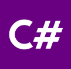

## 走进C#

#### 1、学习目标

* 了解C# 是什么。
* 能够知道C# 可以用来干什么。
* 学习C#的方式。

#### 2、C#是什么

 C# 又称“C Sharp”，是微软发布的一种简单、安全、稳定、通用的面向对象编程语言。

C# 是从 C/C++ 衍生出来的，它在继承 C/C++强大功能的同时，抛弃了 C/C++ 的一些复杂特性。C# 还和 Java 非常类似，仅仅在一些细节上有差别。

> 因此，学过C/C++/Java类似编程语言的人可以快速上手C#。

想要对C#了解更深刻，请参阅网址：https://baike.baidu.com/item/C%23/195147?fr=ge_ala#9

#### 3、C#可以用来干什么

C#运行在 `.NET平台`上，借助C#我们可以开发不同类型的应用程序，例如：

* Windows窗体桌面应用程序;
* 网络应用程序;
* 移动应用开发;
* Unity3D做游戏脚本开发;
* Web服务应用程序;
* 数据库应用程序等。

#### 4、学习C#方式

1. 网上有很多C#教程，你可以跟着这些文档来学。或者买一本C#书籍，一步步的跟着敲。

   > 在学习一个新的事物，我们不说快速掌握熟练它，但是我们可以提高自己和它接触的时间，也可称之为一个对应的环境。
   >
   > 通过构建对应学习环境，即使不是主动地去学习一个东西，我们也可以大概的了解一些相关的事情。

2. 在遇到问题的时候，我们该怎么做？

   * 先独立思考，结合之前学习过的内容，看是否能够解决当前遇到的困难。
   * 如果解决不了，我们可以在网络上查找相关资源(官方文档/教程/视频等)来解决问题。
   * 你也可以问你编程比较厉害的大佬，或许也可以得到对应的答案。

   > 这样做的好处是，培养自己独立解决问题的编程习惯，对于我们自己以后的发展也是有很大的帮助的。

3. 先看后敲

   > 学习C#，敲一个功能或者学习别人一段优秀的代码，我们要先分析它每串代码或者每个结构对应实现的功能。然后将该程序进行分模块，每一步骤实现对应的那个功能。最后，在根据我们思考后的逻辑，进行一步步编码。
   >
   > 当然，最后程序是否可以正常执行，还是需要你不断排错调试滴！

4. 看源码

   > 到了这一步，最好是C#基础掌握以后再看源码，学习大佬是如何搭建C#类库的。当然，在看源码的过程，也是可能会遇到一些问题的，就需要每个学习C#的小伙伴继续按照上述几步不断反复来回横跳的。

