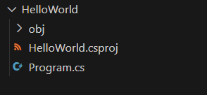

## C#搭建开发环境

#### 1、学习目标

* 使用vscode搭建C#运行环境。
* visual studio 安装 C# 环境。
* 使用配置好的环境，编写第一个C#程序—HelloWorld。


#### 2、VS Code 搭建C#运行环境

> 官网SDK下载地址：https://dotnet.microsoft.com/zh-cn/download/dotnet

##### 2.1 准备阶段

1. 下载 .net6 的sdk，进入官网(https://dotnet.microsoft.com/zh-cn/download)下载,如下图所示：


2. 下载安装VS Code，官网(https://code.visualstudio.com/)


> VS Code根据当前计算机的系统，下载对应平台的安装包。这里因为本人使用的是Windows系统，所以下载Winx64的安装包。


##### 2.2 安装.net6 和 VS Code

###### 安装 .net 6

1.单击安装包，鼠标点击安装按钮，安装完毕如下：


2.输入下面的命令，测试.net 6 SDK是否安装成功：

```bash
dotnet --version
```

如果出现下面的结果，就是安装成功了。


###### VS Code 安装

1. 安装VS Code

   VS Code安装和普通的软件安装流程一样，同意协议 => 点击安装即可。


2. VS Code 插件扩展

   * 安装 `C#`插件

     

   * 安装`code runner`

     


> 其实VS Code中安装一个`C#`插件就足够满足C#在VS Code中编码。


#### 3、Visual Studio 搭建C#运行环境


#### 4、第一个程序—HelloWorld

##### 4.1 创建一个C#程序，打印处HelloWorld

(1) 输入下面命令，创建一个C#程序：

```bash
# 该命令用于创建—控制台应用程序
dotnet new console
# 创建一个控制台程序—HelloWorld
dotnet new console --name HelloWorld
```

结果如下：




(2)进入到HelloWorld项目目录下，输入下面命令，运行项目：

```bash
# 进入到HelloWorld目录下
cd HelloWorld
# 运行项目
dotnet run
```

结果如下：


> 注意点：`dotnet run` = `dotnet build`+`dotnet run`。


##### 4.2 配置 code runner 简化执行C#项目

(1) 进入VS Code 的 `settings` 页面，输入`run in terminal`找到该选项。


(2) 配置 `code runner`，配置`code-runner.executorMap`


(3) 找到`csharp`那一项，配置`csharp`命令：


```json
"csharp":"cd $dir && dotnet run $fileName"
```

执行结果：


##### 4.3 .net5 / .net core 创建控制台程序

案例：创建控制台程序打印出**Hello，World！**

步骤：

1. 执行 dotnet new globaljson --sdk-version xxx (xxx为.net5/.netcore的版本号)

   > 该步骤目的是为了创建一个`global.json`文件，保证当前项目目录下的SDK版为指定版本(默认是最新版本)。

2. 执行 dotnet new console  创建控制台应用程序

3. 直接运行即可

   > 通过dotnet命令创建的项目，默认模板都为 `Hello，World`，所以我们不需要添加任何代码。

```C#
using System;

namespace Net6
{
    class Program
    {
        static void Main(string[] args)
        {
            Console.WriteLine("Hello World!");
        }
    }
}
```

上述代码为`.net 6`之前的Program的基本代码块结构，后面会进行解析。