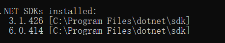
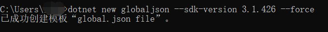
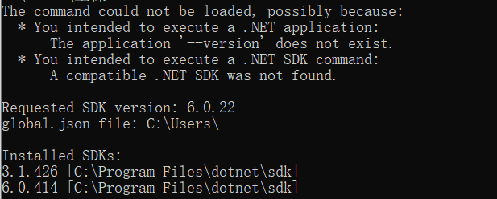

## dotnet命令小知识点

#### 1、本章目的

了解可以辅助我们更好地学习C#编程的工具。

* .net SDK
* .net CLI
  * dotnet 命令
* ...


#### 2、global.json

##### 2.1 切换.NET SDK 使用版本

**使用场景**：当我们所使用的C#项目，遇到了版本问题，或者某些程序集因为SDK版本问题出现冲突，导致程序报错。

**解决**：创建global.json文件来配置 .NET CLI 所使用的版本。

切换步骤：

* 命令`dotnet --info`查看SDK版本。
* 根据对应SDK版本号创建对应的 `global.json`文件。


查看SDK版本：



这里本人用的是 `.NET 6`，如果想要切换为 `.net core 3.1`版本使用如下指令：

```bash
# 指令语法
dotnet new globaljson --sdk-version 版本号 --force
# 在当前目录中创建 global.json，将 SDK 版本设置为 3.1.426
# --force:强制生成内容，即使会更改现有文件，也不例外。 当选择的模板将覆盖输出目录中的现有文件时，需要执行此操作。
dotnet new globaljson --sdk-version 3.1.426 --force 
```

切换成功的结果如下：



如果想切换回来，使用同样的方法即可。

> 参考文档：
>
> * [global.json 概述](https://learn.microsoft.com/zh-cn/dotnet/core/tools/global-json)
> * [dotnet new](https://learn.microsoft.com/zh-cn/dotnet/core/tools/dotnet-new)


##### 2.2 切换 .NET版本后，可能会出现的错误



如果你也出现了上图的错误，是因为你实际上使用的SDK版本号和`global.json`文件上的版本号对应不上，将当前global.json文件的`sdk`的版本修改为当前使用的SDK版本号即可。

```json
{
  "sdk": {
    "version": "3.1.426"
  }
}
```


##### 2.3 切换.NET SDK版本的误区

当你在C盘执行了该条指令`dotnet new globaljson --sdk-version xxx --force`，你可能会出现这样的问题：

* 困惑为什么在C盘中创建了`global.json`文件，且指定了对应的版本，但是为什么在其他磁盘(D/F)还是原来版本(或者当前安装的最新版本)。

**原因**：

> 通过使用命令"dotnet new globaljson --sdk-version xxx --force"来切换指定版本的DotNet SDK只会在当前工作目录生效，而其他盘符仍然使用原来的版本。这是因为DotNet SDK的版本是在每个工作目录中进行设置的，而**不是全局设置**。

所以，当你在某个工作目录中更改了版本后，只有在该工作目录下的项目才会使用新的版本，其他工作目录中的项目仍然使用原来的版本。


对此，如果你的电脑上安装了多个`SDK`，有如下建议:

1. 你在需要创建项目的文件夹下先通过上述指令创建一个`global.json`文件，来指定对应的`SDK`版本号。
2. 通过`dotnet --version`或者`dotnet --info`查看当前目录下版本是否切换成功。
3. 最后，你就可以创建一个对应SDK版本的项目了！


